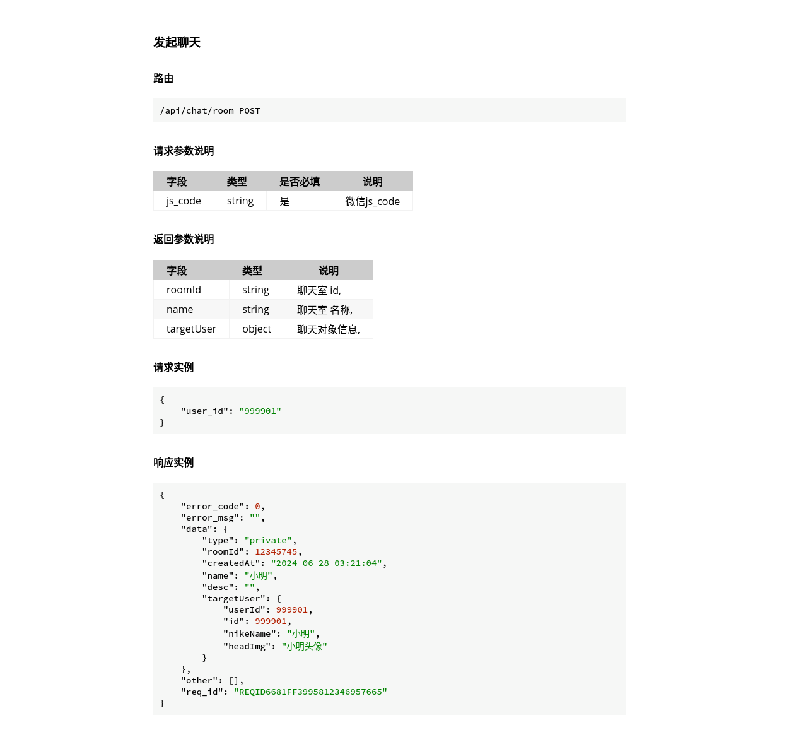
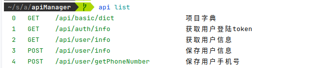
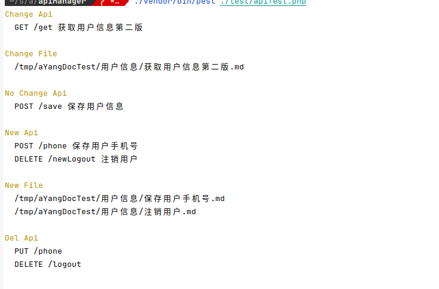

# PHP Api Document

[]()
[](README.en.md)

一个简单的使用注解生成接口文档的命令行工具类


## 预览效果


## 生成的文档 见 ./docs/apis


## 功能概览

- 根据注解生成接口 md格式文档，可以用 mdBook 生成html，也可以自行扩展
- 可以设置guzzle/http 客户端 ，根据注解请求接口，返回结果整合到文档中

## 项目地址

- **github** https://github.com/ayang9999/api

- **gitee** https://gitee.com/luyoujing/api

## 快速安装

- Requirement PHP 8.0+

```bash
composer require ayang/api
```

## 快速开始

- 注解编写
```php

use Ayang\ApiManager\Attr\api;
use Ayang\ApiManager\Attr\param;
use Ayang\ApiManager\Attr\request;
use Ayang\ApiManager\Attr\response;
use Ayang\ApiManager\Attr\respField;

class userController
{
    #[api(name:"获取用户信息", path: "/getInfo", method: "get", desc: "返回参考保存用户信息字段", category: "用户信息")]
    #[param("id", "int", '用户id', true)]
    #[respField("real_status", "bool", "实名认证 0未提交1审核中2通过3拒绝")]
    #[respField("education_status", "bool", "学历认证 0未提交1审核中2通过3拒绝")]
    #[respField("work_status", "bool", "company认证 0未提交1审核中2通过3拒绝")]
    #[respField("activity", "string", "活跃度")]
    #[respField("is_reg", "bool", "是否注册")]
    #[request(['id' => 1], right: false)]
    #[response('{"name":"小明"}')]
    public function getInfo()
    {
    }
}
```

- 生成文档

```php
$dir = "/tmp/aYangDocTest"; //文档目录
$cateFile = "/tmp/aYangDocTest/cate.md"; //文档导航

$apiList = \Ayang\ApiManager\apiEntity::getByClass(\Ayang\ApiManager\Test\example\userController::class);
$maker = new \Ayang\ApiManager\Doc\documentMaker($apiList, new \Ayang\ApiManager\Display\Format\markdownFormat(), $dir, $cateFile);
$display = new \Ayang\ApiManager\display($maker);

$display->listApi();//列出全部 api

$maker->makeAll(); //生成文档
$maker->makeOne("GET", "/getInfo"); //生成或者覆盖指定单个接口

$display->printLog();//文档变化的接口

$maker2 = new \Ayang\ApiManager\Doc\documentMaker($apiList, new \Ayang\ApiManager\Display\Format\markdownFormat(), $dir, $cateFile);

$maker2->showChange();
$display = new \Ayang\ApiManager\display($maker2);
$display->printLog();//检查注解变化的接口
$maker2->makeCategoryFile();// 生成导航文件
```


- 根据注解发起http请求

```php
//$resp = new GuzzleHttp\Psr7\Response(200,[],'{"code":0}');
//$guzzleClient = Mockery::mock(GuzzleHttp\Client::class);
//$guzzleClient->allows([
//    "request" => $resp//new GuzzleHttp\Psr7\Response(200,[],'{"code":0}')
//]);
// 根据注解 request 进行请求

$guzzleClient = new GuzzleHttp\Client();
$apiClient = new \Ayang\ApiManager\apiClient($guzzleClient);
$maker->setApiClient($apiClient);
$maker->makeAll();//or $maker->makeOne("GET", "/getInfo");
$display = new \Ayang\ApiManager\display($maker);
$display->printLog();//文档变化的接口
```

##  命令行显示
```php
$maker->showChange();  
$display->listApi();
```


## 依赖包

- [inhere/console](https://github.com/inhere/php-console)
- [guzzlehttp/guzzle](https://github.com/guzzle/guzzle/)
- [sebastian/diff]()
